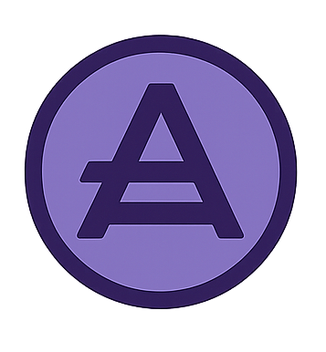
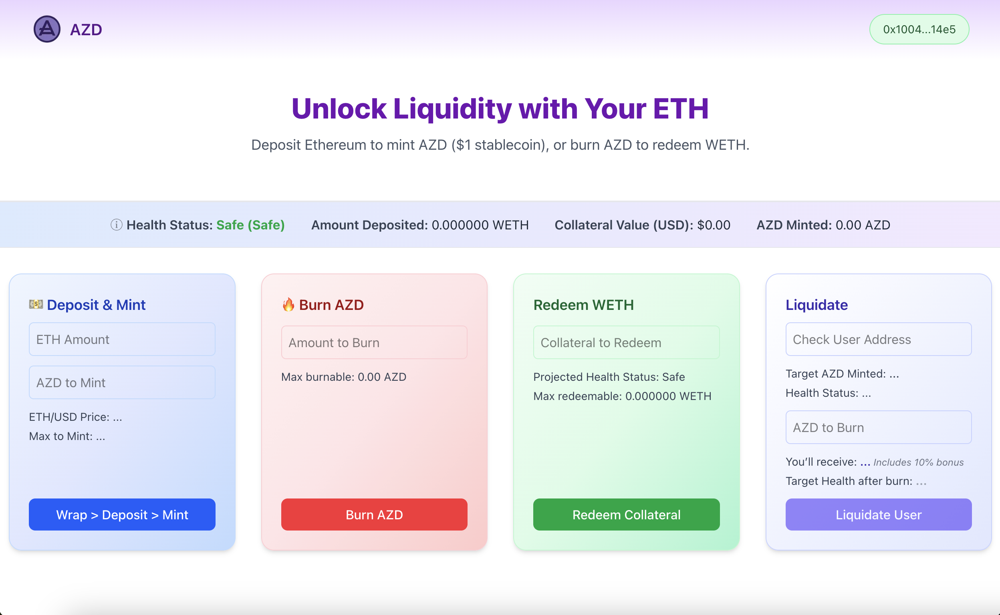

<h1> 
AZD — Azevedo Dollar Stablecoin</h1>

A fully on-chain **overcollateralized stablecoin protocol** built with Solidity and Foundry, featuring React + Tailwind front-end for minting, burning, redeeming, and liquidating positions.

> **Smart Contracts (Deployed on Ethereum Sepolia Testnet)**  
> 📝 [StableCoin](https://sepolia.etherscan.io/token/0x8cA1a0E543b8C02B29e5e9C3f7EC18EEb82b157f)
> 📝 [AZD Engine Protocol](https://sepolia.etherscan.io/address/0xF525ff53e1a384eBFe58b5F4E11FD82721DD25A4)


> **Live Demo *Building the Azevedo Dollar***  
> 🔗 [Open dApp website](https://azd-delta.vercel.app/)
> 🎥 [Watch Demo on Loom](https://www.loom.com/share/2c9acdae45d6435baffbe3160cfb255c)


---

## Overview

AZD is an exogenous decentralized stablecoin backed by **wETH collateral** and designed to maintain stability through **overcollateralization** and **liquidation mechanisms**. Relative Stability Pegged -> $1.00

Users can:

- 💰 Deposit ETH (protocol wrap as WETH) to **mint** AZD  
- 🔥 **Burn** AZD to reduce debt  
- ♻️ **Redeem** collateral  
- ⚖️ **Liquidate** unhealthy positions  

The UI provides real-time updates on collateral value, minting limits, and health factor metrics.

---

## Smart Contract Architecture

The AZDEngine contract is designed to support multiple collateral assets. For this version, the frontend implements the flow only for wETH to simplify the user experience. The backend is built in Solidity using **Foundry** for deployment, testing, and verification.

### Core Contracts

- **AZDEngine.sol**:Core logic for minting, burning, redeeming, and liquidation
- **DecentralizedStableCoin.sol**: ERC20-compliant stablecoin token
- **PriceFeed integration**: Chainlink AggregatorV3Interface for real-time ETH/USD price updates

### Key Mechanisms

- **Overcollateralization** — prevents undercollateralized loans.  
- **Health Factor** — determines user’s liquidation risk.  
  - `> 1.5` → Safe  
  - `1.2–1.5` → At Risk  
  - `1.0–1.2` → Danger Zone  
  - `< 1.0` → Liquidatable  

- **Liquidation Bonus (10%)** — incentivizes third parties to liquidate unsafe positions.  
- **Chainlink Price Feeds** — ensure consistent USD valuations.

---

## Frontend (Next.js + TailwindCSS)

The UI was designed to feel **intuitive and trustworthy**, showcasing DeFi mechanics.  
Each operation is separated into modular “cards” for clarity:

### Core Sections

- **Deposit & Mint** | Wrap ETH → Deposit WETH → Mint AZD (in one flow)
- **Burn AZD** | Repay debt to increase your Health Factor 
- **Redeem Collateral** | Withdraw wETH based on remaining collateral 
- **Liquidate** | Cover another user’s debt and claim their collateral (with bonus)

---

## Smart Contract Flow

```text
Deposit ETH  →  AZDEngine wraps  →  Mint AZD
Burn AZD    →  Repay debt       →  Increase Health Factor
Redeem ETH   →  Withdraw WETH    →  Decrease Health Factor
Liquidate    →  Burn AZD        →  Receive collateral (with bonus)
```

---

## Local Installation

### Smart Contracts Setup

```bash
git clone https://github.com/leticiaazevedo/defi-stablecoin
cd defi-stablecoin/smart-contracts
git submodule update --init --recursive
forge build
forge coverage
```


### Frontend Setup

```bash
cd defi-stablecoin/frontend-integration
npm install
npm run dev
```

